<p align="center">
  
</p>
<div align="center">


</div>

<br>

## ⚡ ABOUT ME

```bash
$ cat about_me.txt
```

```yaml
> Cybersecurity graduate focused on offensive & defensive security
> Passionate about threat modeling, malware analysis, and digital forensics
> I break things to understand how to defend them
> Always mapping the attack surface before the defenders do
```

<br>

## 🎯 SECURITY FOCUS

<div align="center">

| Domain | Focus Area |
|---|---|
| 🛡️ **Blue Team** | SOC operations, log analysis, incident response |
| 🎭 **Threat Intelligence** | STRIDE modeling, risk scoring, attack surface mapping |
| 🐛 **Malware Analysis** | Static/dynamic analysis, ransomware behavior simulation |
| 🕵️ **Digital Forensics** | Steganography detection, artifact recovery |
| 🍯 **Deception Tech** | Honeypot deployment & attacker behavior analysis |

</div>

<br>

## 🧰 TOOLS & TECHNOLOGIES

<div align="center">

**Languages**


**Security Tooling**


**Platforms & Infra**


</div>

<br>

## 📂 FEATURED PROJECTS

```
$HOME/projects
│
├── 🦠 Ransomware-Simulation
│   └── Controlled sandbox simulation of ransomware behavior for
│       defensive research and detection-rule development
│
├── 🧩 Threat-Modeling-Assistant
│   └── Rule-based STRIDE engine that auto-generates assets, threats,
│       mitigations, and risk scores from a YAML/JSON app definition
│
├── 🍯 Honeypot-Lab
│   └── Deployed low/medium-interaction honeypots to capture and
│       analyze real-world attacker TTPs
│
└── 🖼️ Steganography-Investigation
    └── Toolkit for detecting and extracting hidden payloads from
        image/audio carriers during forensic investigations
```

<br>

## 📡 CURRENTLY LEARNING

<div align="center">


</div>

<br>

## 📶 CONNECT WITH ME

<div align="center">

[](https://linkedin.com/in/your-handle)
[](https://github.com/your-handle)
[](mailto:your-email@example.com)
[](https://tryhackme.com/p/your-handle)

</div>

<br>


</div>
